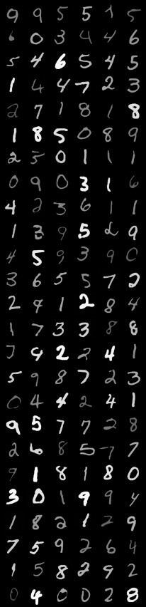
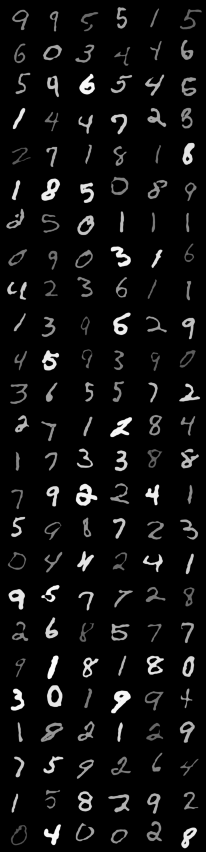
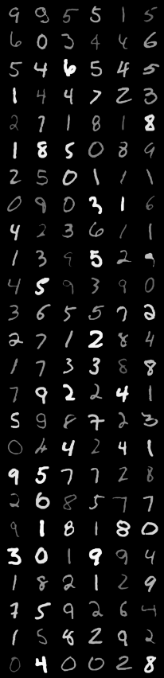

## Diffusion Models in Counterfactual Image Generation

This is the official code for the MSc thesis "Diffusion Models in Counterfactual Image Generation" by Yuxuan Wang in
Imperial College London. The code is based on the DDIM by [ermongroup](https://github.com/ermongroup/ddim) and Causal-Gen
by [BioMedia-MIRA](https://github.com/biomedia-mira/causal-gen).

### Installation
```commandline
pip install -r requirements.txt
```

### Training DDIM
```commandline
python main.py --config morphomnist.yml --exp exp --doc morphomnist_ddim
```

### Training PGM
```commandline
bash src/run_local.sh
```

### Evaluation
```commandline
python eval.py --config morphomnist.yml --exp exp --doc morphomnist_ddim
```

### Here are some examples of the generated images:
<div style="display: flex; justify-content: space-around;">
  <div>
    
    <br>
    <em>DDIM(T=50)</em>
  </div>
  <div>
    
    <br>
    <em>HVAE</em>
  </div>
  <div>
    
    <br>
    <em>Origin</em>
  </div>
</div>

### Here are some examples of the generated counterfactual images:
<div style="text-align: center;">
  <div>
    
  </div>
</div>
<div style="text-align: center;">
  <div>
    
  </div>
  Sample 1 
</div>

<div style="text-align: center;">
  <div>
    
  </div>
</div>
<div style="text-align: center;">
  <div>
    
  </div>
  Sample 2 
</div>

<div style="text-align: center;">
  <div>
    
  </div>
</div>
<div style="text-align: center;">
  <div>
    
  </div>
  Sample 3 
</div>